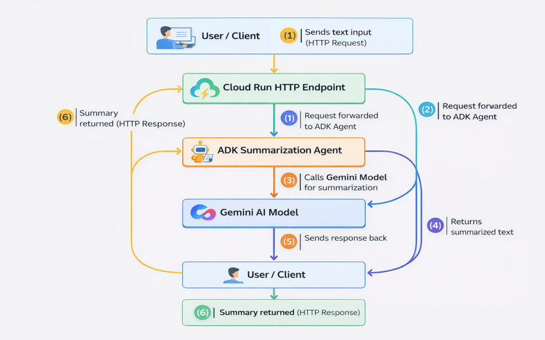
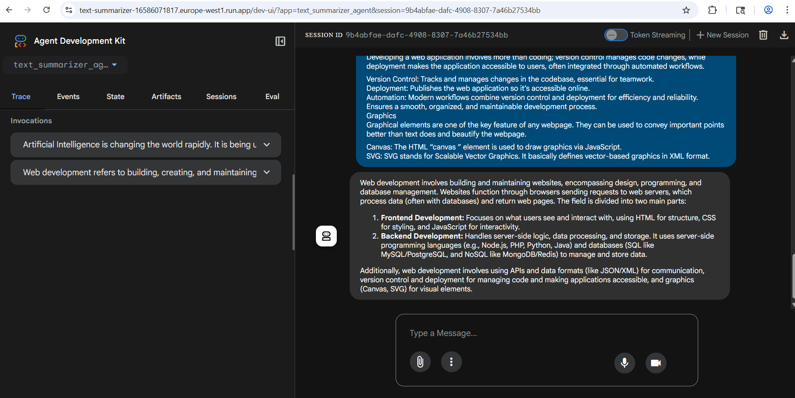

# Text-summarizer-agent
---
A GenAI-powered Text Summarizer Agent built using Google ADK during Google Gen AI Academy APAC Edition (Cohort 1, Track 1) to generate concise and meaningful summaries from input text.

---

## 📌 Project Overview
This project is a **cloud-hosted AI Text Summarization Agent** developed as part of the **Google Gen AI Academy APAC Edition (Cohort 1 - Track 1)** mini project.

The agent takes a long paragraph or text as input and generates a **short, clear, and meaningful summary** using the **Gemini AI model**. The solution is built using **Google ADK (Agent Development Kit)** and deployed on **Google Cloud Run**, making it accessible through an **HTTP endpoint**.

---

## 🎯 Problem Statement
Reading long articles, documents, and paragraphs can be time-consuming. This project solves the problem by converting lengthy text into a short and meaningful summary, helping users save time and understand content faster.

---

## 💡 Idea Brief
- This project is a simple AI-based **Text Summarization Agent**
- It takes long text as input and generates a short summary
- Built using **Google ADK** and powered by the **Gemini AI model**
- Deployed on **Google Cloud Run**
- Accessible anytime through an **HTTP API endpoint**
- Helps make reading easier by summarizing lengthy content

---

## 🌟 Key Highlights (USP)
- Cloud-hosted AI agent accessible via API anytime
- Summaries generated using Gemini for better accuracy
- Simple and fast response through Cloud Run deployment
- Can be integrated into websites, apps, or other tools easily

---

## ✨ Features
- Accepts long text as input
- Generates short and meaningful summaries
- Powered by Gemini AI model for accurate summarization
- Built using Google ADK (Agent Development Kit)
- Hosted on Google Cloud Run
- Callable through an HTTP endpoint
- Real-time response
- Easy integration with any application

---

## 🏗️ Technologies Used

### Core Technologies
- **Python** – for implementing agent logic
- **Google ADK (Agent Development Kit)** – for building and defining the AI agent
- **Gemini Model (Vertex AI)** – for summarization and inference
- **Google Cloud Run** – for hosting the agent as a web service

### Cloud & Deployment Tools
- **Cloud Build** – for automated container build and deployment
- **Artifact Registry** – for storing Docker container images
- **HTTP REST API** – for sending input and receiving summarized output
- **Google Cloud Logging** – for monitoring and debugging the deployed service

---

## 🔄 Process Flow
1. User sends input text using an HTTP request  
2. Cloud Run service receives the request  
3. Google ADK agent processes the prompt  
4. Gemini model generates the summary  
5. API returns summarized output to the user  

---

## 📌 Process Flow Diagram


---

## 📷Agent Screenshots


---

## 🚀 Live Deployment Link
The agent is deployed on Google Cloud Run and can be accessed here:

🔗 Live API Endpoint: https://text-summarizer-16586071817.europe-west1.run.app

# 🛠️ Installation & Setup (Local)

## 1️⃣ Clone the Repository
```bash
git clone https://github.com/Sejal-2004/text-summarizer-agent.git
cd text-summarizer-agent
```

## 2️⃣ Install Dependencies
```bash
pip install -r requirements.txt
```
## 3️⃣ Setup Environment Variables

Create a .env file in the project root and add:
```bash
PROJECT_ID=your_project_id
PROJECT_NUMBER=your_project_number
SA_NAME=your_service_account_name
SERVICE_ACCOUNT=your_service_account_email
MODEL=gemini-2.5-flash
```

## ▶️ How to Run the Agent

Run locally using:

```bash
python agent.py
```
## 📌 API Usage (Example Request)

### Example using curl:

```bash
curl -X POST "YOUR_CLOUD_RUN_ENDPOINT" \
-H "Content-Type: application/json" \
-d '{"text": "Paste your long paragraph here"}'
```
### Example Response:
```bash
{
  "summary": "This is the summarized output text."
}
```
---

## 📚 Learning Outcomes (Google Gen AI Academy APAC)

Through this project and the Google Gen AI Academy APAC cohort, I gained hands-on experience in:

- Understanding the concept of **AI agents** and how they differ from traditional AI model usage
- Building and configuring a single-task agent using **Google ADK (Agent Development Kit)**
- Writing clear and effective **agent instructions (prompt engineering)** to generate accurate summaries
- Integrating the agent with the **Gemini model** for real-world text summarization
- Deploying an AI solution on **Google Cloud Run** as a scalable web service
- Using **Cloud Build** for automated container build and deployment
- Managing container images using **Artifact Registry**
- Understanding how to expose an AI agent through an **HTTP REST API endpoint**
- Monitoring and debugging the deployed service using **Google Cloud Logging**
- Organizing and documenting an end-to-end GenAI project in a professional GitHub repository

This cohort helped me understand how to build, deploy, and maintain GenAI applications as real cloud-hosted services.

---

## 📬 Contact

- 📧 Email: [sejalsingh8647@gmail.com](mailto:sejalsingh8647@gmail.com)  
- 🔗 LinkedIn: [Sejal Singh](https://www.linkedin.com/in/sejal-singh-97669b314)  
- 💻 GitHub: [Sejal-2004](https://github.com/Sejal-2004)

---
## 📌 Disclaimer

This project was created for educational and portfolio purposes as part of the **Google Gen AI Academy APAC Edition (Cohort 1 - Track 1)**.

Unauthorized reuse, redistribution, or commercial usage of this project is not permitted.
